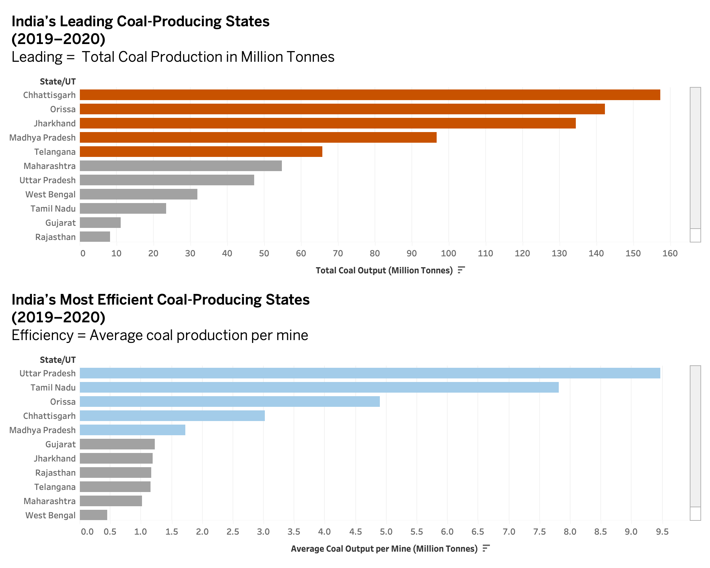

| [home page](https://abdulhad-eng.github.io/Visualizing-With-Hadi/) | [data viz examples](dataviz-examples) | [critique-by-design](critique-by-design.md) | [final project I](final-project-part-one) | [final project II](final-project-part-two) | [final project III](final-project-part-three) |

# Redesigning India’s Coal Production Visualization for Clarity and Comparative Insight

## Step one: the visualization

### Original Visualization

*Source: [Makeover Monday Week 4 Dataset – data.world](https://data.world/makeovermonday/2021w4)*

I selected this visualization because it attempted to show **Coal Production (MT)** and **Number of Mines** for Indian districts in a single bar chart. However, the dual-axis approach made it confusing—two different metrics were plotted together without clear labeling or logical comparison.  

I chose it because it had strong potential: it contained rich data and a real opportunity to tell a meaningful story about **which states produce the most coal** versus **which produce it most efficiently**. The original design buried that insight under clutter, color overload, and scale confusion

## Step two: the critique

After evaluating the “Indian Coal Mine Production” visualization using Stephen Few’s *Data Visualization Effectiveness Profile*, I found that while the dataset itself was valuable, the chart failed to communicate insight effectively. It scored low on usefulness (3/10), completeness (4/10), and perceptibility (3/10), showing that the design made interpretation unnecessarily difficult. The dual-axis layout confused the comparison between production and number of mines, and the lack of context—such as efficiency or production per mine—left the viewer guessing about meaning.

The visualization was somewhat truthful (8/10) since the data appeared valid, but it lacked intuitiveness (4/10) and engagement (4/10). It didn’t invite exploration or tell a story; instead, it presented raw data in a cluttered form. Its aesthetics (5/10) were neutral—neither distracting nor compelling.

The intended audience likely includes policymakers, journalists, and analysts seeking insight into regional production patterns. However, the visualization doesn’t help them answer key questions such as *Which states are most productive?* or *Which are most efficient?*  

In my redesign, I plan to separate total production and efficiency (production per mine) into two clear bar charts, sorted in descending order and color-coded to highlight the top five performers. I’ll also refine titles, labels, and context to help the audience understand the story instantly without effort.

## Step three: Sketch a solution

For my initial redesign sketch, I created a draft Tableau view comparing **total coal production by state** and **production efficiency (production per mine)**. This prototype allowed me to explore how separating production and efficiency could reveal different patterns across regions.

In this stage, my goal was not visual polish but conceptual clarity — I wanted to test if these two metrics could be understood independently and still tell a cohesive story. I used color to highlight top-performing states while keeping the rest neutral to preserve context. The descending order helped surface India’s leading producers and most efficient states at a glance.

Below is the early sketch version of the redesign:

## Step four: Test the solution

Before conducting my interviews, I prepared a short feedback script to understand how clearly my redesigned visualization communicates information about **coal production** and **production efficiency** across Indian states. The goal was to see if viewers could interpret the message; identifying top producers and most efficient states without needing my explanation.  

**Questions to ask:**

- Can you tell me what you think this is?
- Can you describe to me what this is telling you?
- Is there anything you find surprising or confusing?
- Who do you think is the intended audience for this?
- Is there anything you would change or do differently?

### Results  

| **Question**                      | **Student 1 (PPM, Climate Sector Experience)** | **Student 2 (MISM 16, Data Science Experience)** |
|-----------------------------------|------------------------------------------------|--------------------------------------------------|
| What do you think this is?        | Title is pretty explanatory.                   | Coal output and efficiency. 
| What stands out first?            | The highlighted bars.                          | The highlighted bars. 
| Was anything confusing?           | Hard to compare the two graphs clearly.        | Unsure if these are two versions of the same thing. 
| Who do you think is the audience? | Energy development companies.                  | Government policymakers. 
| One thing you would change.       | Change colors between the two charts.          | Change color for distinction. 
---

### Synthesis  

Both participants immediately understood the topic of the visualization — **coal production and efficiency** — indicating that the title and general purpose were clear. The color highlights successfully drew attention, but both respondents pointed out confusion when comparing the two charts. This suggests that the **distinction** between them could be improved.  

A recurring theme was **color differentiation**. Both students mentioned that the colors were too similar, making it difficult to distinguish between “high producers” and “highly efficient” states. The **intended audience** was identified correctly as policymakers and energy professionals, showing that the framing is appropriate. However, the design can better serve this audience through stronger **comparability and clearer visual separation**.  

### Planned design changes  

- Use **distinct color palettes** for each chart to separate production from efficiency.  
- Include a **subtitle or annotation** clarifying what “efficiency” and "leading" represents.
- Change the placement of two graphs from side-by-side to up and down. 

## Step five: Build your solution

After receiving peer feedback and refining my design, I built the final visualization in **Tableau**.  
My goal was to make India’s coal production data both **clearer and more comparative**, allowing the audience to see which states dominate in total output versus which states operate most efficiently per mine.

---

### 🔄 Refining the Design

From the feedback stage, two recurring insights stood out:
1. **Color clarity** — Both interviewees found it confusing that the two charts looked visually similar.  
   → I solved this by assigning distinct color schemes: **orange** for *total production* and **blue** for *efficiency*.
2. **Comparability** — Viewers struggled to connect the same states across charts.  
   → I aligned both charts vertically and added subtitles explaining the metrics.

I also incorporated explicit metric definitions beneath each title so the user doesn’t have to infer what “Leading” or “Efficiency” means. This structure immediately sets expectations for how to interpret the visuals.

---

### 🧩 The Final Visualization

---

### 🧠 What the Redesign Shows

The redesigned visualization separates **scale** and **efficiency**, providing a more nuanced story of India’s coal sector.  
- The top chart shows the *biggest producers* like **Chhattisgarh** and **Orissa** driving the majority of national output.  
- The bottom chart reveals *efficiency leaders* such as **Uttar Pradesh** and **Tamil Nadu**, which achieve higher per-mine productivity despite smaller total output.

Together, these charts allow policymakers, analysts, and journalists to explore whether production dominance aligns with operational efficiency—and where future investments or reforms might yield the most impact.

---

### 🧭 Why This Redesign Matters

The original visualization presented both measures in a single cluttered view, making it hard to interpret. My redesign applies principles from **Stephen Few’s Data Visualization Effectiveness Profile** and **Good Charts**, focusing on:
- **Clarity** – Separating two related metrics for easier interpretation.  
- **Perceptibility** – Using descending bars for natural visual ranking.  
- **Truthfulness** – Including clear units and definitions for each measure.  
- **Aesthetics** – Applying minimal color emphasis to highlight key states while reducing noise.  

By simplifying structure and emphasizing meaning, the final design tells a more compelling, evidence-driven story about production versus efficiency.

---

### 🧾 Citations and References

- Original Data Visualization: [MakeoverMonday 2021/W4 – Indian Coal Mine Production](https://data.world/makeovermonday/2021w4)  
- Source Dataset: Ministry of Coal, Government of India (2019–2020)  
- Reference: Few, Stephen. *Data Visualization Effectiveness Profile*, 2017.  
  [http://www.perceptualedge.com/articles/visual_business_intelligence/data_visualization_effectiveness_profile.pdf](http://www.perceptualedge.com/articles/visual_business_intelligence/data_visualization_effectiveness_profile.pdf)

---

### 🤖 AI Acknowledgement

AI (ChatGPT-5) was used to assist with structure, wording, and refinement of Markdown formatting for this write-up.  
All design, visualization, and analysis work were completed independently by me using **Tableau**.

